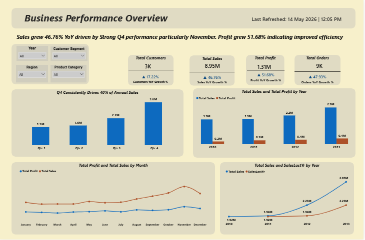
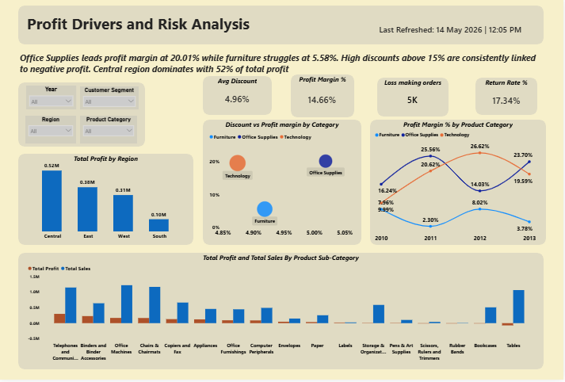
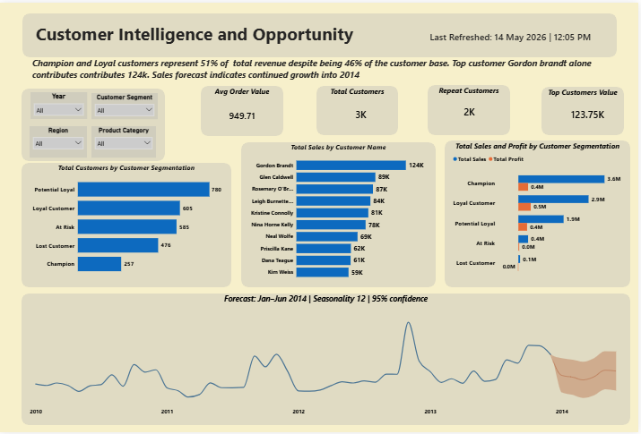

# RetailIQ | Business Intelligence Dashboard
### End-to-End Sales, Profit & Customer Intelligence | Power BI

---

## 📌 Project Overview

RetailIQ is a 3-page interactive Business Intelligence dashboard built on the Superstore dataset. It combines KPI reporting, profitability analysis, customer segmentation (RFM), and time series forecasting to surface insights that drive real business decisions.

This is not a chart collection. Every visual answers a specific business question.

---

## 🖼️ Dashboard Preview

### Page 1 — Business Performance Overview


### Page 2 — Profit Drivers and Risk Analysis


### Page 3 — Customer Intelligence and Opportunity


---

## 🗂️ Dashboard Structure

### Page 1 — Business Performance Overview
**Business Question:** Is the business growing?

| KPI | Value | YoY Growth |
|-----|-------|------------|
| Total Sales | 8.95M | ▲ 46.76% |
| Total Profit | 1.31M | ▲ 51.68% |
| Total Orders | 9K | ▲ 47.93% |
| Total Customers | 3K | ▲ 17.22% |

**Charts:**
- Total Sales by Quarter
- Total Sales and Total Profit by Year
- Total Profit and Total Sales by Month
- Total Sales vs SalesLastYr by Year

---

### Page 2 — Profit Drivers and Risk Analysis
**Business Question:** What is driving or killing profit?

| KPI | Value |
|-----|-------|
| Avg Discount | 4.96% |
| Profit Margin % | 14.66% |
| Loss Making Orders | 5K |
| Return Rate % | 17.34% |

**Charts:**
- Discount vs Profit Margin by Category (Scatter Plot)
- Profit Margin % by Product Category over Time
- Total Profit by Region
- Total Profit and Total Sales by Product Sub-Category

---

### Page 3 — Customer Intelligence and Opportunity
**Business Question:** Who are our customers and where is the next opportunity?

| KPI | Value |
|-----|-------|
| Avg Order Value | 949.71 |
| Total Customers | 3K |
| Repeat Customers | 2K |
| Top Customer Value | 123.75K |

**Charts:**
- Total Customers by Customer Segmentation (RFM)
- Total Sales by Customer Name (Top 10)
- Total Sales and Profit by Customer Segmentation
- Sales Forecast: Jan–Jun 2014 | Seasonality 12 | 95% Confidence

---

## 🔍 Key Findings

- Total Sales of **8.95M grew 46.76% YoY** while Total Profit grew faster at **51.68%** — a sign of improving efficiency
- **Q4 is driven primarily by November alone** — December is actually declining within the same quarter
- **5K loss-making orders** exist within a growing business — value is leaking silently
- **Return Rate is 17.34%** — roughly 1 in 6 orders returned
- **Furniture profit margin has declined to 3.78% in 2013** — Tables sub-category is recording negative profit
- **Champion and Loyal customers are 46% of the base** but generate **51% of revenue**
- **Top customer Gordon Brandt contributes 124K alone** — dangerous concentration risk
- **Central region dominates with 52% of total profit** while South contributes only 0.10M

---

## 💡 Key Insights

- Profit growing faster than sales signals healthy margin expansion — but margin compression is quietly emerging across all three product categories by 2013
- November is not Q4 — it IS the entire story of Q4. The business has a **4–6 week peak window**, not a full quarter
- Time series forecasting projects a **Q1 2014 dip** — Jan at 192K, dipping to 164K in March before recovering toward 219K by June
- High discounts above 15% are **directly and consistently linked to negative profit** across all categories
- Furniture's problem is **not discounting** — it sits at the lowest discount level yet has the lowest margin. The issue is structural cost
- **585 At Risk customers** represent a significant retention opportunity

---

## ✅ Recommendations

1. **Reframe Q4 planning around November** — build inventory and promotions to peak in November not spread across the quarter
2. **Use the Q1 2014 forecast proactively** — reduce procurement and preserve cash between January and March
3. **Immediately discontinue or reprice Tables** — negative profit compounds with every order
4. **Cap discounts at 15% company-wide** with approval required above that threshold
5. **Launch a retention campaign targeting 585 At Risk customers** before they become Lost Customers
6. **Investigate the 17.34% return rate** by product sub-category and region
7. **Build a second high-value customer pipeline** to reduce dependency on Gordon Brandt
8. **Conduct a full cost audit of Furniture** — the margin problem is not solvable through pricing alone

---

## 🛠️ Tools & Techniques

| Tool/Technique | Usage |
|---------------|-------|
| Power BI | Dashboard design and visualisation |
| DAX | Calculated measures and KPIs |
| Data Modelling | Relationships and Date Table |
| Time Series Forecasting | 6-month sales forecast with seasonality |
| RFM Segmentation | Customer segmentation |
| YoY Analysis | Year over Year growth calculations |
| KPI Dashboard Design | Business performance tracking |
| Data Storytelling | Insight-driven narrative across 3 pages |

---

## 📁 Repository Structure

```
RetailIQ-BI-Dashboard/
│
├── README.md
├── RetailIQ_Dashboard.pbix
├── data/
│   └── Superstore.csv
├── images/
│   ├── Page1-Business-Performance.png
│   ├── Page2-Profit-Drivers.png
│   └── Page3-Customer-Intelligence.png
└── documentation/
    └── DAX_Measures.md
```

---

## 📊 Key DAX Measures

```dax
-- Total Sales
Total Sales = SUM(Orders[Sales])

-- Sales Last Year
Sales LY = CALCULATE([Total Sales], 
    DATEADD('Date Table'[Date], -1, YEAR))

-- YoY Growth %
YoY Growth % = DIVIDE([Total Sales] - [Sales LY], [Sales LY])

-- Profit Margin
Profit Margin % = DIVIDE([Total Profit], [Total Sales])

-- Customer Segmentation
Customer Segment = 
SWITCH(TRUE(),
[RFM Score] >= 10, "Champion",
[RFM Score] >= 8, "Loyal Customer",
[RFM Score] >= 6, "Potential Loyal",
[RFM Score] >= 4, "At Risk",
"Lost Customer")
```

---

## 🚀 How to Use

1. Clone this repository
2. Open `RetailIQ_Dashboard.pbix` in Power BI Desktop
3. Update the data source path to your local `Superstore.csv` if prompted
4. Refresh the data
5. Use the Year, Region, Customer Segment and Product Category slicers to explore

---

## 👤 Author

**Vivian Celine**  
Data Analyst | Power BI | SQL | DAX

🔗 [LinkedIn](https://linkedin.com/in/vivian-celine)  
🔗 [GitHub](https://github.com/Vivian-celine)

---

`#PowerBI` `#DataAnalytics` `#BusinessIntelligence` `#DAX` `#RFMAnalysis` `#Forecasting` `#DataStorytelling`
